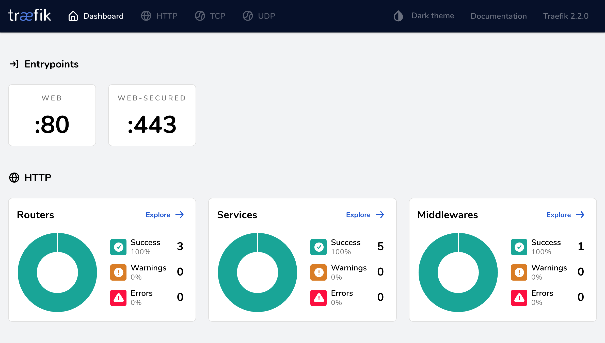

# Proxy/Load Balancer

## Why?

- HTTPS with Let's encrypt
- Proxy
- Automatically discover other Docker stack containers (without restarting. not like apache/nginx, no additional configuration on this repo required)

## What for

This docker stack is a base for any other docker stack on the same server.

If you want to add other docker stack (erddap, ncwms, flask/django/fastapi, vuejs, whatever) later, install this repo first. You don't touch this anymore. Only what you need is to configure docker-compose.yml on other docker stack by adding a label section.

When you correctly set up the "labels" section in other docker-compose.yml, Traefik will discover other containers and routes of subdirectories when cotainers up. Besides, Traefik redirects routes to https with Let's Encrypt certificate. No restarting nor resetting is required. 

## Set up

0. Docker must be installed
1. Download this repo
2. Install this at a new server/droplet
   - \$ sh init.sh # create a docker network
   - modify traefik.toml if needed (e.g. Hostname)
   - generate .htpasswd or add the line into .htpasswd
   - \$ docker-compose up -d

3. Check if installed properly (https://domain.name/dashboard/) with id & password stored in .htpasswd

Treafik Dashboard

## THEN run other docker stack.

## Reference
https://docs.traefik.io/user-guides/docker-compose/acme-tls/

